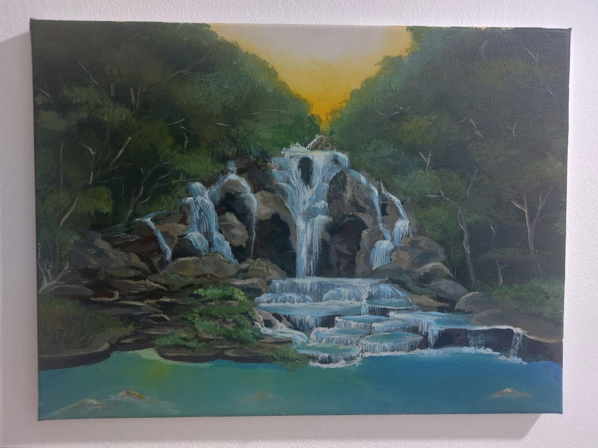
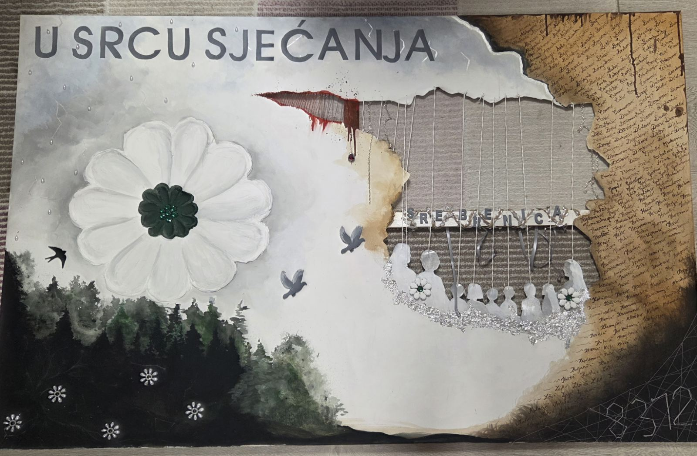
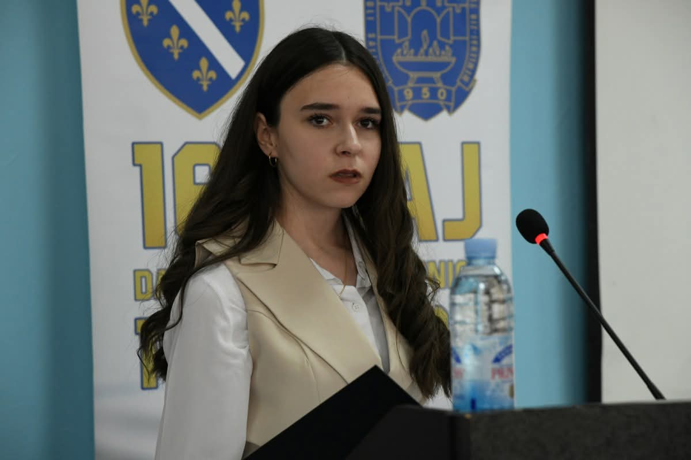

 

<h3>Tehničar računarstva</h3>

Spoj tehničke preciznosti, kreativnog izražavanja i društvene odgovornosti.

---

## O meni

Zdravo, ja sam **Arabela Salihbegović**, učenica trećeg razreda Srednje elektrotehničke škole u Tuzli.

Moji interesi spajaju dva svijeta: tehnologiju i umjetnost. Kroz elektrotehniku učim kako funkcionišu sistemi, automatika, mikrokontroleri i obnovljivi izvori energije, dok kroz slikarstvo i pisanje izražavam emocije, ideje i poglede na društvo.

Vjerujem da tehnologija rješava probleme, ali da joj kreativnost, empatija i društveni angažman daju pravi smisao.

---

## Tehničke oblasti koje me zanimaju

 

<table>
<tr>
<td width="33%" align="center">

### Embedded sistemi

Rad sa mikrokontrolerima, logičkim sklopovima, senzorima i interaktivnim hardverskim sistemima.

</td>
<td width="33%" align="center">

### Automatika

Projektovanje sekvencijalnih sistema, digitalne logike i simulacija u Flowcode i Proteusu.

</td>
<td width="33%" align="center">

### Obnovljiva energija

Dimenzionisanje i analiza autonomnih solarnih sistema za praktičnu i održivu primjenu.

</td>
</tr>
</table>

---

## Projekti i interesovanja

<table>
<tr>
<td width="50%" valign="top">

<h3>Smart Bio-Alert Panel</h3>

Interaktivni hardverski koncept za prikaz i vizualizaciju podataka pomoću mikrokontrolera i ekrana.

</td>

<td width="50%" valign="top">

<h3>Fishing Game • STM32 & Keil µVision</h3>

Samostalno razvijena igrica u programskom okruženju Keil µVision za STM32 mikrokontrolere. Projekat uključuje grafički prikaz, upravljanje logikom igre i interakciju korisnika kroz embedded sistem.

</td>
</tr>
</table>

## Kreativni rad

<table>
<tr>
<td width="50%" valign="top">

<h3>Slikarstvo</h3>

Bavim se slikanjem akrilom i uljem na platnu. Kroz boje, teksture i motive istražujem emocije, prostor i lični doživljaj svijeta.

</td>

<td width="50%" valign="top">

<h3>Književnost</h3>

Pišem literarne radove, eseje i poeziju. Pisanje mi omogućava da ideje i osjećaje pretvorim u priče koje ostavljaju trag.

</td>
</tr>
</table>
## Društveni angažman

Aktivno učestvujem u omladinskim projektima i inicijativama koje imaju za cilj poboljšanje zajednice.

Posebno mjesto u mom radu zauzima **Civitas – Projekat Građanin**, gdje kroz istraživanje problema u zajednici, timski rad i prijedloge rješenja učestvujem u promociji građanskog aktivizma i očuvanju kulturno-historijskog naslijeđa Bosne i Hercegovine.

---
---

## Objave i priznanja

Tokom svog školovanja učestvovala sam u projektima, takmičenjima i aktivnostima koje su prepoznali obrazovni i medijski portali.

### Medijske objave

- [Festival rada 2026](https://youtu.be/8wDRdtE-kAs?si=sgRT5Me7ddCGGXCm)
- [Noć istraživača](https://etstuzla.skolatk.edu.ba/view-more/jos-jedno-prvo-mjesto-za-nasu-skolu-na-naucnoistrazivackom-sajmu/304)
- [Prvo mjesto na državnom konkursu](https://tuzlalive.ba/ucenice-iz-tuzle-osvojile-prvo-mjesto-na-drzavnom-konkursu-o-nasilju-se-ne-suti/#google_vignette)
- [Dani Hasana Kaimije](https://www.facebook.com/vijestiztuzle/posts/na-ovogodi%C5%A1njoj-kulturnoj-manifestaciji-dani-hasana-kaimije-tre%C4%87u-nagradu-osvoji/1579154169812938)
- [Biografija](https://www.facebook.com/ETSTZ/posts/nagra%C4%91eni-literarni-radovina%C5%A1e-u%C4%8Denice-osvojile-su-zapa%C5%BEene--rezultate-u%C4%8De%C5%A1%C4%87em-u-/1297689811871516)
- [Gostovanje na RTV TK](https://youtu.be/7UFogk2kpsg?si=TAWLh8qKCvLU56a-)
- [Projekat građanin](https://radiosarajevo.ba/metromahala/teme/mladi-upozoravaju-na-stanje-historijskih-objekata/628920)

### Istaknute aktivnosti

- Učešće na Civitas takmičenju „Projekat Građanin“
- Predstavljanje tehničkih projekata i istraživanja
- Društveni i omladinski aktivizam
- Državno takmičenje, Biosigurnost i biozaštita
---

## Galerija - društveni i kreativni rad

<table>
<tr>
<td width="33%" align="center">

 
Obilježavanje

</td>

<td width="33%" align="center">

 
Projekti

</td>

<td width="33%" align="center">

 
Manifestacije

</td>
</tr>
</table>

## Kontakt

Tuzla, Bosna i Hercegovina

<a href="https://www.linkedin.com/in/arabela-salihbegovi%C4%87-98405a372/">
LinkedIn profil
</a>

